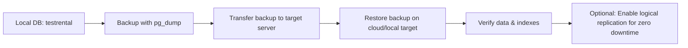
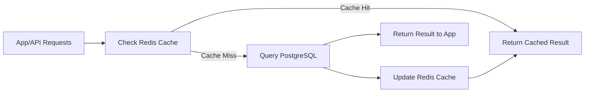
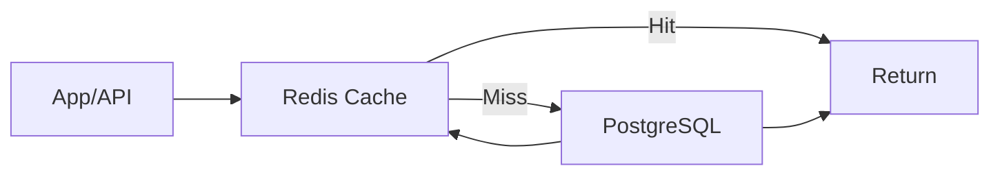

# PostgreSQL Guide: Robot Actuator & Trajectories Data

1. **ER Diagram** for the schema
2. **Workflow Diagram** for backup → migration → restore

Here’s the updated Markdown:

---

## 1. Database Schema Design

We use **schemas (namespaces)** to organize data per robot or project. The main tables are:

* **robots** – robot metadata
* **trajectories** – each trajectory run for a robot
* **actuator_data** – time-series readings of actuators for each trajectory

### **1.1 ER Diagram**

```mermaid
erDiagram
    ROBOTS ||--o{ TRAJECTORIES : has
    TRAJECTORIES ||--o{ ACTUATOR_DATA : contains

    ROBOTS {
        int robot_id PK
        text name
        text model
    }
    TRAJECTORIES {
        int trajectory_id PK
        int robot_id FK
        text name
        timestamp start_time
        timestamp end_time
        text description
    }
    ACTUATOR_DATA {
        bigserial data_id PK
        int trajectory_id FK
        int actuator_id
        timestamp timestamp
        double precision position
        double precision velocity
        double precision torque
    }
```

**Explanation:**

* Each robot can have multiple trajectories.
* Each trajectory can have multiple actuator readings.
* Indexes on `trajectory_id` and `timestamp` improve query speed for time-series data.

---

### **1.2 SQL Schema Example**

```sql
CREATE SCHEMA robot_alpha;

CREATE TABLE robot_alpha.robots (
    robot_id SERIAL PRIMARY KEY,
    name TEXT NOT NULL,
    model TEXT
);

CREATE TABLE robot_alpha.trajectories (
    trajectory_id SERIAL PRIMARY KEY,
    robot_id INT REFERENCES robot_alpha.robots(robot_id),
    name TEXT,
    start_time TIMESTAMP,
    end_time TIMESTAMP,
    description TEXT
);

CREATE TABLE robot_alpha.actuator_data (
    data_id BIGSERIAL PRIMARY KEY,
    trajectory_id INT REFERENCES robot_alpha.trajectories(trajectory_id),
    actuator_id INT NOT NULL,
    timestamp TIMESTAMP NOT NULL,
    position DOUBLE PRECISION,
    velocity DOUBLE PRECISION,
    torque DOUBLE PRECISION
);

CREATE INDEX idx_trajectory_time ON robot_alpha.actuator_data(trajectory_id, timestamp);
CREATE INDEX idx_actuator_time ON robot_alpha.actuator_data(actuator_id, timestamp);
```

---

## 2. Importing Data

### **2.1 From CSV**

```bash
COPY robot_alpha.actuator_data(trajectory_id, actuator_id, timestamp, position, velocity, torque)
FROM '/path/to/trajectory.csv' DELIMITER ',' CSV HEADER;
```

**Explanation:**

* Fast, server-side import.
* CSV should match the table column order.

---

### **2.2 From YAML (Python)**

```python
import yaml, psycopg2

with open("actuator_data.yaml") as f:
    data = yaml.safe_load(f)

conn = psycopg2.connect(dbname="your_db", user="your_user", password="your_pass", host="localhost")
cur = conn.cursor()

for row in data:
    cur.execute("""
        INSERT INTO robot_alpha.actuator_data
        (trajectory_id, actuator_id, timestamp, position, velocity, torque)
        VALUES (%s,%s,%s,%s,%s,%s)
    """, (row['trajectory_id'], row['actuator_id'], row['timestamp'],
          row['position'], row['velocity'], row['torque']))

conn.commit()
cur.close()
conn.close()
```

**Explanation:**

* Use for structured files (YAML/JSON).
* Allows transformations before inserting.

---

### **2.3 Directly from App**

* Use **ORM** (SQLAlchemy, Django ORM, Hibernate) or raw drivers.
* Use **prepared statements or bulk inserts** for performance.

---

## 3. Backups & Migration

### **3.1 Backup**

```bash
# Standard
pg_dump -U myuser -h localhost -Fc testrental -f testrental.dump

# Compressed (large DBs)
pg_dump -U myuser -h localhost -Fc testrental | gzip > testrental.dump.gz
```

### **3.2 Restore**

```bash
# Standard restore
pg_restore -U cloud_user -h cloud_host -d testrental -C -v /tmp/testrental.dump

# Restore compressed
gunzip -c testrental.dump.gz | pg_restore -U cloud_user -h cloud_host -d testrental -C -v
```

### **3.3 Migration Workflow Diagram**



**Explanation:**

* Step 1: Take reliable backup.
* Step 2: Move to target server (SCP or cloud upload).
* Step 3: Restore with `pg_restore`.
* Step 4: Verify tables & row counts.
* Step 5: Use replication if minimal downtime required.

---

## 4. Performance Tuning

### **4.1 Indexing**

```sql
CREATE INDEX idx_trajectory_time ON robot_alpha.actuator_data(trajectory_id, timestamp);
CREATE INDEX idx_actuator_time ON robot_alpha.actuator_data(actuator_id, timestamp);
```

### **4.2 Analyze Query Plans**

```sql
EXPLAIN ANALYZE
SELECT * FROM robot_alpha.actuator_data
WHERE trajectory_id = 1
ORDER BY timestamp DESC
LIMIT 100;
```

### **4.3 Partitioning**

```sql
CREATE TABLE robot_alpha.actuator_data_2026_03
PARTITION OF robot_alpha.actuator_data
FOR VALUES FROM ('2026-03-01') TO ('2026-04-01');
```

### **4.4 Caching**

* Use **Redis** for hot trajectories to reduce DB load.

### **4.5 Maintenance**

```sql
ANALYZE robot_alpha.actuator_data;  -- update statistics
VACUUM robot_alpha.actuator_data;    -- reclaim space
```

---

## ✅ Summary

1. **Schema**: robots → trajectories → actuator_data
2. **Data import**: CSV, YAML, or directly from app
3. **Backups**: `pg_dump -Fc -f backup.dump`
4. **Migration**: Transfer → Restore → Verify → Optional replication
5. **Performance**: Indexing, EXPLAIN ANALYZE, partitioning, caching
6. **Maintenance**: VACUUM, ANALYZE


## ✅ Summary Workflow

1. **Schema**: `robots`, `trajectories`, `actuator_data` in a schema (`robot_alpha`).
2. **Data import**: CSV, YAML, or directly from app.
3. **Backups**: `pg_dump -Fc -f backup.dump` (or compressed).
4. **Migration**: Transfer dump → restore with `pg_restore`.
5. **Performance**: Indexes, EXPLAIN ANALYZE, partitioning, caching.
6. **Maintenance**: VACUUM, ANALYZE regularly.

---

Perfect! Let’s extend with **performance testing, load testing, and caching** so it becomes a **complete hands-on guide** for robot actuator & trajectory data in PostgreSQL.

---

# PostgreSQL Guide: Robot Actuator & Trajectories Data (Extended)

## 5. Performance Testing & Query Optimization

### **5.1 Measure Query Response Time**

* Use **Postman** or any API client if your app exposes endpoints:

```text
GET /api/trajectories/1/actuators
```

* Record **response time** for queries that fetch actuator data.
* This identifies slow queries before tuning.

---

### **5.2 Analyze Queries in PostgreSQL**

```sql id="ql5mta"
EXPLAIN ANALYZE
SELECT * 
FROM robot_alpha.actuator_data
WHERE trajectory_id = 1
ORDER BY timestamp DESC
LIMIT 100;
```

* **EXPLAIN ANALYZE** shows the query plan and execution time.
* Look for **Seq Scan** (sequential scan) → add an index if needed:

```sql id="m2zptn"
CREATE INDEX idx_trajectory_time ON robot_alpha.actuator_data(trajectory_id, timestamp DESC);
```

---

### **5.3 Optimize Queries**

1. Avoid `SELECT *` – fetch only required columns:

```sql id="r9pz2n"
SELECT timestamp, position, velocity, torque
FROM robot_alpha.actuator_data
WHERE trajectory_id = 1
ORDER BY timestamp DESC
LIMIT 100;
```

2. Use indexes on frequently filtered or joined columns.
3. Consider **partitioning** for huge time-series tables (monthly/weekly).

---

## 6. Load Testing with JMeter

* Simulate multiple concurrent users fetching actuator data:

**Steps:**

1. Create **Thread Group** in JMeter (e.g., 50 users, 10-second ramp-up).
2. Add **HTTP Request** or **JDBC Request** sampler targeting your API/DB.
3. Record **response times and throughput**.

**Example JMeter metrics interpretation:**

| Metric          | Description                             |
| --------------- | --------------------------------------- |
| Average         | Average response time per request       |
| 90th percentile | Time under which 90% of requests finish |
| Throughput      | Requests per second handled by DB/API   |

* Use the results to identify bottlenecks.
* If a query slows down under load, check **indexes**, **query plan**, or **caching options**.

---

## 7. Caching Hot Data

* Use **Redis** for frequently accessed actuator or trajectory data:

**Python example:**

```python id="r4t6ks"
import redis, json

# Connect to Redis
r = redis.Redis(host='localhost', port=6379, db=0)

# Store query result
key = "trajectory_1_actuators"
value = json.dumps(query_result)  # query_result from DB
r.setex(key, 300, value)          # cache for 5 minutes

# Retrieve cached result
cached = r.get(key)
if cached:
    data = json.loads(cached)
else:
    # Fetch from PostgreSQL and store in Redis
    pass
```

**Explanation:**

* Cache reduces DB load for **repeated queries**.
* TTL (time-to-live) ensures data freshness.

---

## 8. Combined Workflow for Large-Scale Robot Data



**Explanation:**

* Query first checks **cache**.
* If cache misses, DB is queried, and result is cached for future requests.
* Works well for **hot trajectories or frequent actuator queries**.

---

## 9. Full Maintenance & Optimization Commands

```sql id="maint1"
-- Update statistics for query planner
ANALYZE robot_alpha.actuator_data;

-- Reclaim space
VACUUM robot_alpha.actuator_data;

-- Check database size
SELECT pg_size_pretty(pg_database_size('testrental'));

-- Monitor slow queries (PostgreSQL logs)
SHOW log_min_duration_statement;  -- set threshold in ms
```

* Regular maintenance ensures **consistent performance** over time.

---

## 10. Summary (Extended)

1. **Schema Design:** `robots` → `trajectories` → `actuator_data` with indexes and optional partitioning.
2. **Data Import:** CSV, YAML, or directly via app/ORM.
3. **Backups & Migration:** `pg_dump` → transfer → `pg_restore` → verification.
4. **Query Optimization:** EXPLAIN ANALYZE, indexes, SELECT only needed columns.
5. **Performance Testing:** Postman, JMeter for load testing.
6. **Caching:** Redis for frequently accessed data.
7. **Maintenance:** VACUUM, ANALYZE, monitor logs.
8. **Workflow:** Cache → DB → Return → Update Cache.

---

✅ This extended Markdown now covers:

* **Schema design**
* **Data import**
* **Backups & migration**
* **Query optimization**
* **Load testing**
* **Caching**
* **Maintenance**

It’s essentially a **production-ready guide for handling robot actuator & trajectory data** in PostgreSQL.

---


Perfect! Let’s extend the Markdown file with **performance testing, load testing, and caching** so it becomes a **complete hands-on guide** for robot actuator & trajectory data in PostgreSQL. I’ll continue from the previous Markdown.

---

# PostgreSQL Guide: Robot Actuator & Trajectories Data (Extended)

## 5. Performance Testing & Query Optimization

### **5.1 Measure Query Response Time**

* Use **Postman** or any API client if your app exposes endpoints:

```text
GET /api/trajectories/1/actuators
```

* Record **response time** for queries that fetch actuator data.
* This identifies slow queries before tuning.

---

### **5.2 Analyze Queries in PostgreSQL**

```sql id="ql5mta"
EXPLAIN ANALYZE
SELECT * 
FROM robot_alpha.actuator_data
WHERE trajectory_id = 1
ORDER BY timestamp DESC
LIMIT 100;
```

* **EXPLAIN ANALYZE** shows the query plan and execution time.
* Look for **Seq Scan** (sequential scan) → add an index if needed:

```sql id="m2zptn"
CREATE INDEX idx_trajectory_time ON robot_alpha.actuator_data(trajectory_id, timestamp DESC);
```

---

### **5.3 Optimize Queries**

1. Avoid `SELECT *` – fetch only required columns:

```sql id="r9pz2n"
SELECT timestamp, position, velocity, torque
FROM robot_alpha.actuator_data
WHERE trajectory_id = 1
ORDER BY timestamp DESC
LIMIT 100;
```

2. Use indexes on frequently filtered or joined columns.
3. Consider **partitioning** for huge time-series tables (monthly/weekly).

---

## 6. Load Testing with JMeter

* Simulate multiple concurrent users fetching actuator data:

**Steps:**

1. Create **Thread Group** in JMeter (e.g., 50 users, 10-second ramp-up).
2. Add **HTTP Request** or **JDBC Request** sampler targeting your API/DB.
3. Record **response times and throughput**.

**Example JMeter metrics interpretation:**

| Metric          | Description                             |
| --------------- | --------------------------------------- |
| Average         | Average response time per request       |
| 90th percentile | Time under which 90% of requests finish |
| Throughput      | Requests per second handled by DB/API   |

* Use the results to identify bottlenecks.
* If a query slows down under load, check **indexes**, **query plan**, or **caching options**.

---

## 7. Caching Hot Data

* Use **Redis** for frequently accessed actuator or trajectory data:

**Python example:**

```python id="r4t6ks"
import redis, json

# Connect to Redis
r = redis.Redis(host='localhost', port=6379, db=0)

# Store query result
key = "trajectory_1_actuators"
value = json.dumps(query_result)  # query_result from DB
r.setex(key, 300, value)          # cache for 5 minutes

# Retrieve cached result
cached = r.get(key)
if cached:
    data = json.loads(cached)
else:
    # Fetch from PostgreSQL and store in Redis
    pass
```

**Explanation:**

* Cache reduces DB load for **repeated queries**.
* TTL (time-to-live) ensures data freshness.

---

## 8. Combined Workflow for Large-Scale Robot Data


**Explanation:**

* Query first checks **cache**.
* If cache misses, DB is queried, and result is cached for future requests.
* Works well for **hot trajectories or frequent actuator queries**.

---

## 9. Full Maintenance & Optimization Commands

```sql id="maint1"
-- Update statistics for query planner
ANALYZE robot_alpha.actuator_data;

-- Reclaim space
VACUUM robot_alpha.actuator_data;

-- Check database size
SELECT pg_size_pretty(pg_database_size('testrental'));

-- Monitor slow queries (PostgreSQL logs)
SHOW log_min_duration_statement;  -- set threshold in ms
```

* Regular maintenance ensures **consistent performance** over time.

---

## 10. Summary (Extended)

1. **Schema Design:** `robots` → `trajectories` → `actuator_data` with indexes and optional partitioning.
2. **Data Import:** CSV, YAML, or directly via app/ORM.
3. **Backups & Migration:** `pg_dump` → transfer → `pg_restore` → verification.
4. **Query Optimization:** EXPLAIN ANALYZE, indexes, SELECT only needed columns.
5. **Performance Testing:** Postman, JMeter for load testing.
6. **Caching:** Redis for frequently accessed data.
7. **Maintenance:** VACUUM, ANALYZE, monitor logs.
8. **Workflow:** Cache → DB → Return → Update Cache.

---

✅ This extended Markdown now covers:

* **Schema design**
* **Data import**
* **Backups & migration**
* **Query optimization**
* **Load testing**
* **Caching**
* **Maintenance**

It’s essentially a **production-ready guide for handling robot actuator & trajectory data** in PostgreSQL.

---

Perfect! Here’s a **concise one-page PostgreSQL cheat sheet** based on everything we discussed, focused on **robot actuator & trajectory data**, ready for **interviews or quick reference**.

---

# PostgreSQL Cheat Sheet: Robot Actuator & Trajectories Data

## **1. Schema Design**

```sql
-- Create schema
CREATE SCHEMA robot_alpha;

-- Robots
CREATE TABLE robot_alpha.robots (
    robot_id SERIAL PRIMARY KEY,
    name TEXT NOT NULL,
    model TEXT
);

-- Trajectories
CREATE TABLE robot_alpha.trajectories (
    trajectory_id SERIAL PRIMARY KEY,
    robot_id INT REFERENCES robot_alpha.robots(robot_id),
    name TEXT,
    start_time TIMESTAMP,
    end_time TIMESTAMP,
    description TEXT
);

-- Actuator readings
CREATE TABLE robot_alpha.actuator_data (
    data_id BIGSERIAL PRIMARY KEY,
    trajectory_id INT REFERENCES robot_alpha.trajectories(trajectory_id),
    actuator_id INT NOT NULL,
    timestamp TIMESTAMP NOT NULL,
    position DOUBLE PRECISION,
    velocity DOUBLE PRECISION,
    torque DOUBLE PRECISION
);

-- Indexes for fast queries
CREATE INDEX idx_trajectory_time ON robot_alpha.actuator_data(trajectory_id, timestamp);
CREATE INDEX idx_actuator_time ON robot_alpha.actuator_data(actuator_id, timestamp);
```

---

## **2. Data Import**

### CSV

```bash
COPY robot_alpha.actuator_data(trajectory_id, actuator_id, timestamp, position, velocity, torque)
FROM '/path/to/trajectory.csv' DELIMITER ',' CSV HEADER;
```

### YAML (Python)

```python
import yaml, psycopg2
data = yaml.safe_load(open("actuator_data.yaml"))
conn = psycopg2.connect("dbname=your_db user=your_user host=localhost")
cur = conn.cursor()
for row in data:
    cur.execute("INSERT INTO robot_alpha.actuator_data VALUES (%s,%s,%s,%s,%s,%s)",
                (row['trajectory_id'], row['actuator_id'], row['timestamp'], row['position'], row['velocity'], row['torque']))
conn.commit(); cur.close(); conn.close()
```

---

## **3. Backup & Migration**

### Backup

```bash
pg_dump -U myuser -h localhost -Fc testrental -f testrental.dump
pg_dump -U myuser -h localhost -Fc testrental | gzip > testrental.dump.gz
```

### Restore

```bash
pg_restore -U cloud_user -h cloud_host -d testrental -C -v /tmp/testrental.dump
gunzip -c testrental.dump.gz | pg_restore -U cloud_user -h cloud_host -d testrental -C -v
```

### Transfer

```bash
scp testrental.dump cloud_user@cloud_host:/tmp/
```

---

## **4. Query Optimization & Performance**

```sql
-- Check execution plan
EXPLAIN ANALYZE SELECT * FROM robot_alpha.actuator_data WHERE trajectory_id=1 ORDER BY timestamp DESC LIMIT 100;

-- Indexes
CREATE INDEX idx_trajectory_time ON robot_alpha.actuator_data(trajectory_id, timestamp DESC);

-- Partitioning
CREATE TABLE robot_alpha.actuator_data_2026_03
PARTITION OF robot_alpha.actuator_data
FOR VALUES FROM ('2026-03-01') TO ('2026-04-01');
```

---

## **5. Load Testing**

* Use **JMeter** to simulate multiple users hitting APIs or JDBC queries.
* Measure **average, percentile response time**, and **throughput**.
* Identify slow queries → optimize indexes or queries.

---

## **6. Caching Hot Data (Redis Example)**

```python
import redis, json
r = redis.Redis(host='localhost', port=6379, db=0)
key = "trajectory_1_actuators"
r.setex(key, 300, json.dumps(query_result))  # cache 5 min
cached = r.get(key)
if cached: data = json.loads(cached)
```

---

## **7. Maintenance**

```sql
ANALYZE robot_alpha.actuator_data;  -- update stats
VACUUM robot_alpha.actuator_data;    -- reclaim space
SELECT pg_size_pretty(pg_database_size('testrental')); -- check DB size
SHOW log_min_duration_statement;      -- monitor slow queries
```

---

## **8. Workflow Summary**



**Key Points:**

* Schema → Data → Index → Backup → Migrate → Optimize → Cache → Maintain.
* Always **test queries**, **measure response times**, and **maintain DB regularly**.

---
